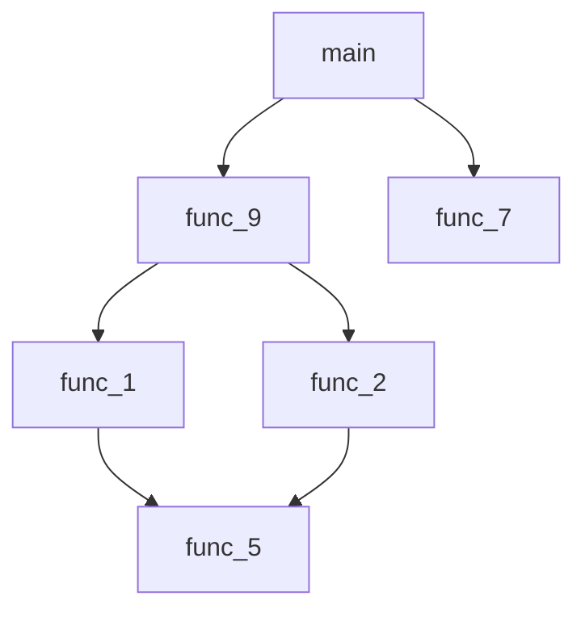

# My Site
### [GitHub Pages](https://pages.github.com/) docs

  

Docs

#### Syntax
* [Official documentation](https://docs.github.com/en/get-started/writing-on-github/getting-started-with-writing-and-formatting-on-github/basic-writing-and-formatting-syntax)1
#### Examples
* [Example project 1](https://github.com/)
* [Example project 2](https://github.com/)

  

Docs 2

* [Nothing](https://github.com/)
* [Anything](https://github.com/)

## Instructions
1. Do this
2. Do that
3. Run command

## Thing
<picture>
  
</picture>

| Command | Description |
| --- | --- |
| `version` | Show app version |
| `folder` | Show app folder |
| `help` | Show help |

## Chart

---
